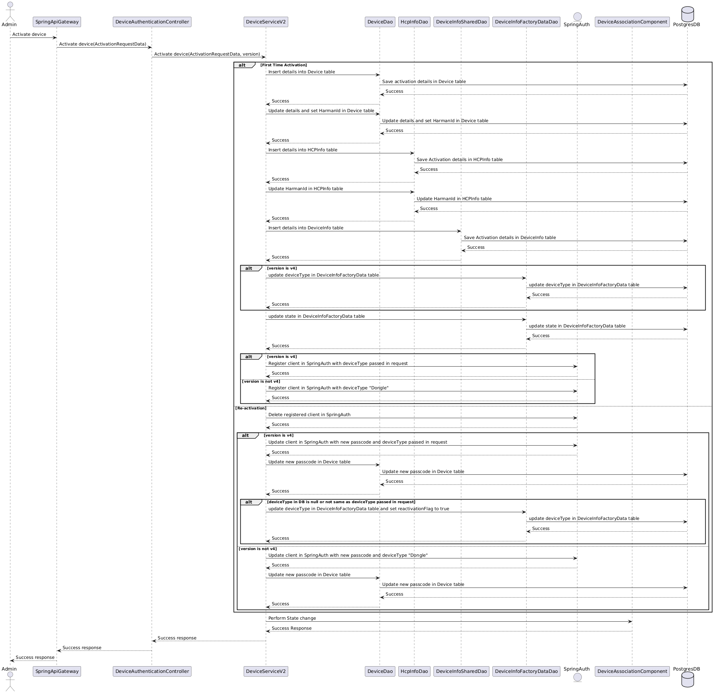

[](logo.png)

[](../../actions/workflows/maven-build.yml)
[](../../actions/workflows/license-compliance.yml)
[](../../actions/workflows/documentation.yml)

# Device Activation

Device Activation Component provides restful services for activating and reactivating devices like Dongle, HU, TCU and Dashcam; so that these devices can send data to the cloud post activation/reactivation.

# Table of Contents
* [Getting Started](#getting-started)
* [Architecture](#architecture)
* [Usage](#usage)
* [How to contribute](#how-to-contribute)
* [Built with Dependencies](#built-with-dependencies)
* [Code of Conduct](#code-of-conduct)
* [Contributors](#contributors)
* [Security Contact Information](#security-contact-information)
* [Support](#support)
* [Troubleshooting](#troubleshooting)
* [License](#license)
* [Announcements](#announcements)
* [Acknowledgments](#acknowledgments)


## Getting Started

To build the project in the local working directory after the project has been cloned/forked, run:

```mvn clean install```

from the command line interface.

### Prerequisites

1. The list of tools required to build and run the project:
   JDK 17
   Apache Maven 3.8

Download and Install Apache Maven 3.8 locally and follow the below steps for IntelliJ IDE:
* Go to the right corner of the IDE and get inside the Maven option.
* Select the Maven Settings option and set the Maven Home Path to the path of the Apache Maven 3.8 installed locally.
* Click Apply and then OK.

2. Postgres DB needs to be installed and ignite database/schema should be created with the required tables.

* Link of the database and table scripts to be installed :
  [dmpostgres.sql](../../../csp-opensource-charts/blob/main/postgresql/db-scripts/dmpostgres.sql)

3. Add below secrets using secret.yaml:

```
{
  "hcp-auth-webapp": {
    "client_id": "device-mgmt",
    "client_secret": "*******",
    "hcp_auth_qualifier_secret_key": "HarmanAct"
  }
}
```

* client_id and client_secret : fields used to connect with uidam server.
* hcp_auth_qualifier_secret_key : used for checking the qualifier.

### Installation

[How to set up Maven](https://maven.apache.org/install.html)

[Install Java](https://www.tutorials24x7.com/java/how-to-install-openjdk-17-on-windows)


### Coding style check configuration

[checkstyle.xml](./checkstyle.xml) is the coding standard to follow while writing new/updating existing code.

Checkstyle plugin [maven-checkstyle-plugin:3.2.1](https://maven.apache.org/plugins/maven-checkstyle-plugin/) is integrated in [pom.xml](./pom.xml) which runs in the `validate` phase and `check` goal of the maven lifecycle and fails the build if there are any checkstyle errors in the project.

There are a few coding guidelines to be followed manually before requesting for a pull request, the same can be found here:

[Manual coding guidelines](Link to page with coding guidelines)

### Running the tests

To run the tests for this system run the below maven command.

```mvn test```

Or run a specific test

```mvn test -Dtest="TheFirstUnitTest"```

To run a method from within a test

```mvn test -Dtest="TheSecondUnitTest#whenTestCase2_thenPrintTest2_1"```

### Deployment

We can deploy this component as a Kubernetes pod by installing Device Activation charts.

Link:
[Charts](../../../csp-opensource-charts/tree/main/device-auth)

Detailed information about the request and response generated by the [Device Activation restful services](Refer to API specifics of device-activation).

## Architecture

Sequence diagram of Device Activation:

[](activationSequenceDiagram.png)

## Usage

Device Activation microservice can be used to activate and reactivate devices like Dongle, HU, TCU and Dashcam; so that these devices can send data to the cloud post activation/reactivation.
Devices are activated and maintained in PostgreSQL DB with the Device State as ACTIVE/PROVISION_ALIVE (when device activation is called without performing device association; usually done if end user buys device only for internet connection) and Association Status would be ASSOCIATED after performing Device Association and Device Activation.
The end result of Device Activation/Reactivation is the generation of HarmanID/DeviceID and passcode which would be used by the devices to connect to the cloud.

## Built With Dependencies

* [Spring](https://spring.io/projects/spring-framework) - The web framework used
* [Maven](https://maven.apache.org/) - Dependency Management
* [Postgres](https://jdbc.postgresql.org/) - Postgres JDBC driver
* [Project Lombok](https://projectlombok.org/) - Builder
* [Apache Common](https://commons.apache.org/proper/commons-lang/) - Java Library
* [Jackson](https://github.com/FasterXML) - Reading JSON Objects
* [MChange](https://www.mchange.com/projects/c3p0/) - JDBC3 Connection and Statement Pooling
* [Logback](https://logback.qos.ch/) - Log Functionality
* [slf4j](https://www.slf4j.org/) - Log Functionality
* [Mockito](https://site.mockito.org/) - Mocking Functionality
* [JUnit](https://junit.org/) - Testing Framework

## How to contribute

Please read [CONTRIBUTING.md](./CONTRIBUTING.md) for details on our contribution guidelines, and the process for submitting pull requests to us.

## Code of Conduct

Please read [CODE_OF_CONDUCT.md](./CODE_OF_CONDUCT.md) for details on our code of conduct, and the process for submitting pull requests to us.


## Contributors

The list of [contributors](../../graphs/contributors) who participated in this project.

## Security Contact Information

Please read [SECURITY.md](./SECURITY.md) to raise any security related issues.

## Support

Please write to us at [csp@harman.com](mailto:csp@harman.com)

## Troubleshooting

Please read [CONTRIBUTING.md](./CONTRIBUTING.md) for details on how to raise an issue and submit a pull request to us.

## License

This project is licensed under the Apache-2.0 License - see the [LICENSE](./LICENSE) file for details.

## Announcements

All updates to this component are present in our [releases page](../../releases).
For the versions available, see the [tags on this repository](../../tags).